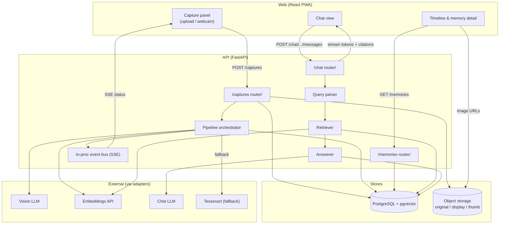
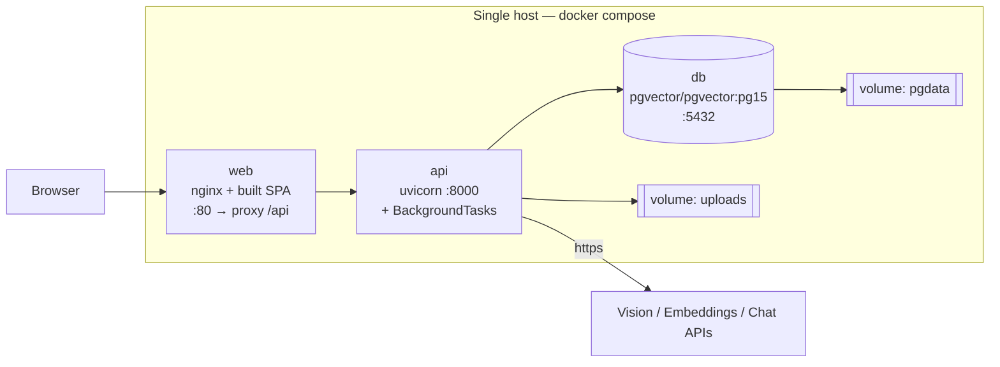
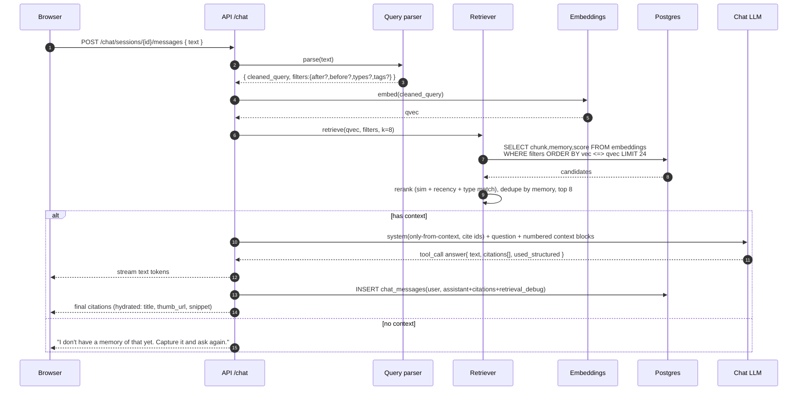
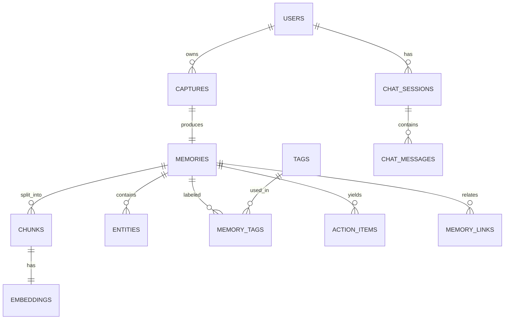

# 03 — Architecture & App Flow

**Product:** MirrorMind
**Related:** [TRD](02-TRD.md) · [Schema](05-SCHEMA.md) · [API Spec](09-API-SPEC.md)

---

## 1. High-level architecture



---

## 2. Runtime / deployment view



- `web` serves static assets and reverse-proxies `/api` and `/api/.../events` (SSE: `proxy_buffering off`).
- `api` runs `alembic upgrade head` on start, then `uvicorn`.
- Object storage in MVP = a bind-mounted `uploads` volume; served via `GET /api/v1/files/...` (API streams the file with caching headers) so there's no second web server or bucket.

---

## 3. Module map (backend)

```
api/
  main.py                 # app factory, middleware, routers, lifespan (db, adapters warmup)
  core/
    config.py             # pydantic-settings
    ids.py                # ULID
    events.py             # in-proc pub/sub -> SSE
    errors.py             # typed errors -> problem+json
    logging.py
  db/
    base.py  session.py
    models.py             # SQLAlchemy models (see Schema doc)
    migrations/           # alembic
  routers/
    captures.py  memories.py  chat.py  action_items.py  digest.py  files.py  health.py
  services/
    pipeline.py           # orchestration + status events
    classifier.py extractor.py embedder.py
    retriever.py answerer.py query_parser.py
    tagging.py action_items.py digest.py
  adapters/
    vision_llm.py chat_llm.py embeddings.py ocr_tesseract.py storage.py
    protocols.py           # Protocol definitions
    fixtures/               # DRY_RUN sample responses
  schemas/                 # Pydantic request/response + internal DTOs (Extraction, Chunk, Answer)
  scripts/
    seed_demo.py reembed.py backup.sh eval_retrieval.py
```

```
web/
  src/
    app/routes.tsx
    features/capture/    CapturePanel.tsx  useCaptureUpload.ts  useCaptureStatus.ts
    features/timeline/   TimelineView.tsx  FilterBar.tsx  MemoryCard.tsx
    features/memory/     MemoryDetail.tsx  StructuredCard.tsx  EntityList.tsx
    features/chat/       ChatView.tsx  MessageList.tsx  CitationChip.tsx  MemoryDrawer.tsx
    lib/api.ts  lib/sse.ts  lib/image.ts (client downscale)
    components/ui/*      (shadcn)
    styles/tokens.css
```

---

## 4. Capture → Memory pipeline (sequence)

```mermaid
sequenceDiagram
  autonumber
  participant U as Browser
  participant A as API /captures
  participant S as Object storage
  participant DB as Postgres
  participant P as Pipeline (bg task)
  participant V as Vision LLM
  participant O as Tesseract
  participant E as Embeddings

  U->>A: POST /captures (image, captured_at, geo?, Idempotency-Key)
  A->>A: validate mime/size, re-encode, strip EXIF (keep orientation)
  A->>S: put original.jpg, display.jpg, thumb.jpg
  A->>DB: INSERT captures(status=queued)
  A-->>U: 201 { capture_id, status:queued }
  A->>P: enqueue(capture_id)

  P->>DB: status=extracting; emit SSE
  P->>V: extract(display.jpg)  [30s timeout, 2 retries]
  alt vision ok
    V-->>P: {type,type_confidence,text,ocr_confidence,title,summary,structured,entities}
  else vision fails
    P->>O: read(display.jpg)
    O-->>P: raw text
    P->>P: type=other, structured=null, confidence=low
  end
  P->>DB: INSERT memories, entities, tags, action_items
  P->>DB: status=embedding; emit SSE
  P->>P: chunk(text) + [title+summary] chunk
  P->>E: embed(chunks)  [batch]
  E-->>P: vectors
  P->>DB: INSERT chunks, embeddings
  P->>DB: status=ready; emit SSE ready
  U->>A: (SSE) ready -> refetch memory
```

**Timing budget (p50):** ingest+resize ≤ 1.2 s · vision ≤ 4 s · persist ≤ 0.2 s · chunk ≤ 0.1 s · embed ≤ 1.5 s → ~7 s to `ready`.

---

## 5. Chat / RAG flow (sequence)



### Query parser rules (MVP)
- Temporal: `today`, `this morning` (00:00–12:00 local today), `this afternoon`, `tonight`, `yesterday`, `last night`, `this week`, `last week`, `on <date>`, `<weekday>` (nearest past). Produces `after`/`before` in the user's tz.
- Type: keyword → type map (`notice|circular|memo → notice`, `timetable|schedule|routine → timetable`, `textbook|book|page|chapter → textbook_page`, `whiteboard|board → whiteboard`, `circuit|schematic → circuit`, `note|notes → handwritten_note`, `slide|deck → slide`).
- Tag/subject: match known tag strings present in the query.
- Fallback: if the rules find nothing and the query clearly implies a constraint, one cheap LLM call returns the same filter JSON. Always echo `used_filters` to the client.

### Re-rank score
```
score = cosine_sim
      + 0.05 * recency_norm          # newer memory, 0..1 over last 14 days
      + 0.08 * (1 if memory.type in filters.types else 0)
      - 0.10 * (1 if same memory already has 2 chunks selected else 0)
```

---

## 6. Data model summary

Entities (full DDL in [Schema](05-SCHEMA.md)):



---

## 7. Key sequences for edge cases

- **Retry:** `POST /captures/:id/retry` → set `status=queued`, clear `error_code`, delete dependent `memories/chunks/embeddings/entities/tags/action_items` for that capture (cascade), re-enqueue from step 2.
- **Correction (stretch):** `PATCH /memories/:id { corrected_text }` → store `corrected_text`, re-chunk + re-embed (delete old chunks/embeddings), keep original `text` for audit.
- **Soft delete:** `deleted_at` set; excluded from retrieval (`WHERE deleted_at IS NULL`) and timeline; hard-delete job after 30 days.
- **SSE drop:** client falls back to `GET /captures/:id` poll every 1.5 s until terminal state.
- **Idempotent create:** same `Idempotency-Key` within 24 h → return the existing capture (200) instead of creating a new one.

---

## 8. Scaling path (post-MVP, informational)

| Bottleneck | v0.2 move |
|---|---|
| BackgroundTasks single process | Arq/Celery worker pool + Redis; `captures.status` already models a queue |
| Local disk storage | `S3Storage` adapter; pre-signed URLs; drop `/files` proxy |
| pgvector on shared PG | Dedicated PG with more RAM; `ivfflat`→`hnsw` tuned `m`/`ef_search`; partition `embeddings` by month |
| One chat model call | Add a cross-encoder reranker; cache query→results for 60 s |
| Single user | Real auth; row-level `user_id` filters already present on every query |
