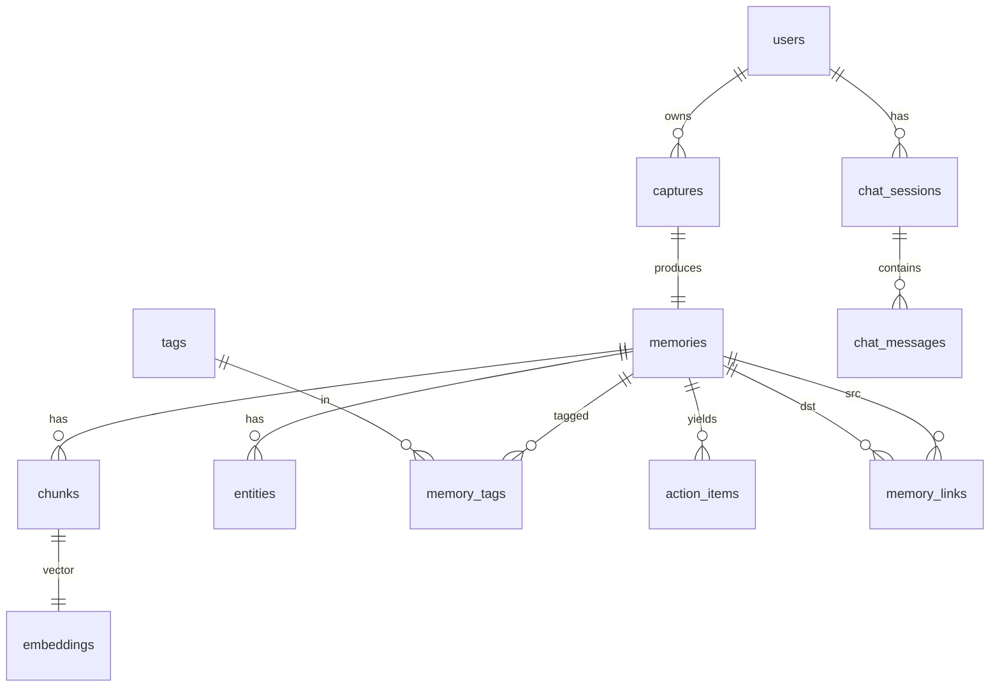

# 05 — Schema (Data Model)

**Product:** Personal AI
**DB:** PostgreSQL 15 + `pgvector`
**Related:** [Architecture](03-ARCHITECTURE.md) · [API Spec](09-API-SPEC.md)

IDs are ULIDs stored as `TEXT` (26 chars, lexicographically sortable). `EMBEDDING_DIMS` default **1024** (`voyage-3.5`); change ⇒ re-embed.

---

## 1. Entity overview

| Table | Purpose |
|---|---|
| `users` | Owner of everything. MVP: one row `demo-user`. |
| `captures` | One upload event: files + metadata + pipeline status. |
| `memories` | Processed result of a capture: text, type, structured payload, summary. 1:1 with capture in MVP. |
| `chunks` | Text segments of a memory for retrieval. |
| `embeddings` | Vector per chunk (separate table to keep `chunks` light and allow model swaps). |
| `entities` | Extracted structured facts (dates, people, places, contacts, subjects). |
| `tags` / `memory_tags` | Free-form + derived labels; many-to-many. |
| `action_items` | Deadlines/tasks derived from a memory. |
| `memory_links` | Relations between memories (same course/event/topic). |
| `chat_sessions` / `chat_messages` | Conversation history + citations + retrieval debug. |
| `idempotency_keys` | De-dupe capture creation. |

---

## 2. ER diagram



---

## 3. DDL

```sql
-- ============ extensions ============
CREATE EXTENSION IF NOT EXISTS vector;
CREATE EXTENSION IF NOT EXISTS pg_trgm;   -- fuzzy text search on titles/tags

-- ============ enums ============
CREATE TYPE capture_status AS ENUM ('queued','extracting','embedding','ready','failed');
CREATE TYPE memory_type    AS ENUM
  ('notice','timetable','textbook_page','whiteboard','circuit','handwritten_note','slide','document','other');
CREATE TYPE confidence_band AS ENUM ('high','medium','low');
CREATE TYPE entity_kind AS ENUM
  ('date','time','deadline','person','place','organization','contact_email','contact_phone','subject','term','url','amount');
CREATE TYPE action_status AS ENUM ('open','done','dismissed');
CREATE TYPE chat_role AS ENUM ('user','assistant','system');

-- ============ users ============
CREATE TABLE users (
  id          TEXT PRIMARY KEY,
  email       TEXT UNIQUE,
  display_name TEXT,
  tz          TEXT NOT NULL DEFAULT 'Asia/Kolkata',
  created_at  TIMESTAMPTZ NOT NULL DEFAULT now()
);

-- ============ captures ============
CREATE TABLE captures (
  id             TEXT PRIMARY KEY,
  user_id        TEXT NOT NULL REFERENCES users(id) ON DELETE CASCADE,
  status         capture_status NOT NULL DEFAULT 'queued',
  error_code     TEXT,
  error_detail   TEXT,
  -- files (object-storage keys, not URLs)
  original_key   TEXT NOT NULL,
  display_key    TEXT NOT NULL,
  thumb_key      TEXT NOT NULL,
  mime           TEXT NOT NULL,
  bytes          INTEGER NOT NULL,
  width          INTEGER,
  height         INTEGER,
  sha256         TEXT NOT NULL,
  -- capture context
  source         TEXT NOT NULL DEFAULT 'upload',      -- 'upload' | 'webcam'
  captured_at    TIMESTAMPTZ NOT NULL,                -- client time; fallback = received_at
  received_at    TIMESTAMPTZ NOT NULL DEFAULT now(),
  latitude       DOUBLE PRECISION,
  longitude      DOUBLE PRECISION,
  device_hint    TEXT,
  -- pipeline timings (ms) for observability
  timings        JSONB NOT NULL DEFAULT '{}'::jsonb,
  created_at     TIMESTAMPTZ NOT NULL DEFAULT now(),
  updated_at     TIMESTAMPTZ NOT NULL DEFAULT now()
);
CREATE INDEX captures_user_time_idx ON captures (user_id, captured_at DESC);
CREATE INDEX captures_status_idx    ON captures (status) WHERE status <> 'ready';
CREATE UNIQUE INDEX captures_user_sha_idx ON captures (user_id, sha256);  -- soft dedupe of identical uploads

-- ============ memories ============
CREATE TABLE memories (
  id             TEXT PRIMARY KEY,
  capture_id     TEXT NOT NULL UNIQUE REFERENCES captures(id) ON DELETE CASCADE,
  user_id        TEXT NOT NULL REFERENCES users(id) ON DELETE CASCADE,
  type           memory_type NOT NULL DEFAULT 'other',
  type_confidence REAL,                               -- 0..1
  title          TEXT NOT NULL DEFAULT '',
  summary        TEXT NOT NULL DEFAULT '',
  text           TEXT NOT NULL DEFAULT '',            -- full extracted text, reading order
  corrected_text TEXT,                                -- user edit (stretch); when set, used for chunking
  ocr_confidence confidence_band NOT NULL DEFAULT 'medium',
  language       TEXT NOT NULL DEFAULT 'en',
  structured     JSONB,                               -- type-specific; shapes in §4
  extractor      TEXT NOT NULL DEFAULT 'vision',      -- 'vision' | 'tesseract'
  model_meta     JSONB NOT NULL DEFAULT '{}'::jsonb,  -- {vision_model, prompt_version, tokens}
  captured_at    TIMESTAMPTZ NOT NULL,                -- denormalized from capture for fast filtering
  deleted_at     TIMESTAMPTZ,
  created_at     TIMESTAMPTZ NOT NULL DEFAULT now(),
  updated_at     TIMESTAMPTZ NOT NULL DEFAULT now()
);
CREATE INDEX memories_user_time_idx ON memories (user_id, captured_at DESC) WHERE deleted_at IS NULL;
CREATE INDEX memories_type_idx      ON memories (user_id, type)            WHERE deleted_at IS NULL;
CREATE INDEX memories_title_trgm    ON memories USING gin (title gin_trgm_ops);
CREATE INDEX memories_structured_gin ON memories USING gin (structured jsonb_path_ops);

-- ============ chunks ============
CREATE TABLE chunks (
  id          TEXT PRIMARY KEY,
  memory_id   TEXT NOT NULL REFERENCES memories(id) ON DELETE CASCADE,
  user_id     TEXT NOT NULL REFERENCES users(id) ON DELETE CASCADE,
  ord         INTEGER NOT NULL,                       -- 0-based order within memory
  kind        TEXT NOT NULL DEFAULT 'body',          -- 'summary' | 'body'
  content     TEXT NOT NULL,
  token_count INTEGER NOT NULL DEFAULT 0,
  captured_at TIMESTAMPTZ NOT NULL,                   -- denormalized for filtered ANN
  type        memory_type NOT NULL,                   -- denormalized
  created_at  TIMESTAMPTZ NOT NULL DEFAULT now(),
  UNIQUE (memory_id, ord)
);
CREATE INDEX chunks_memory_idx ON chunks (memory_id);
CREATE INDEX chunks_filter_idx ON chunks (user_id, captured_at DESC, type);

-- ============ embeddings ============
CREATE TABLE embeddings (
  chunk_id    TEXT PRIMARY KEY REFERENCES chunks(id) ON DELETE CASCADE,
  user_id     TEXT NOT NULL REFERENCES users(id) ON DELETE CASCADE,
  model       TEXT NOT NULL,                          -- e.g. 'voyage-3.5'
  dims        INTEGER NOT NULL,
  embedding   VECTOR(1024) NOT NULL,                  -- keep in sync with EMBEDDING_DIMS
  created_at  TIMESTAMPTZ NOT NULL DEFAULT now()
);
-- ANN index (cosine). Build after bulk load; tune per data size.
CREATE INDEX embeddings_hnsw_cos ON embeddings
  USING hnsw (embedding vector_cosine_ops) WITH (m = 16, ef_construction = 64);
-- filtered queries also use this btree for the WHERE part via chunks join
CREATE INDEX embeddings_user_idx ON embeddings (user_id);

-- ============ entities ============
CREATE TABLE entities (
  id          TEXT PRIMARY KEY,
  memory_id   TEXT NOT NULL REFERENCES memories(id) ON DELETE CASCADE,
  user_id     TEXT NOT NULL REFERENCES users(id) ON DELETE CASCADE,
  kind        entity_kind NOT NULL,
  value_text  TEXT NOT NULL,                          -- as written
  value_norm  TEXT,                                   -- normalized (ISO date, E.164, lowercased name)
  ts_value    TIMESTAMPTZ,                            -- set when kind in (date,time,deadline)
  span_start  INTEGER,                                -- char offset in memories.text (nullable)
  span_end    INTEGER,
  confidence  REAL,
  created_at  TIMESTAMPTZ NOT NULL DEFAULT now()
);
CREATE INDEX entities_memory_idx ON entities (memory_id);
CREATE INDEX entities_kind_ts_idx ON entities (user_id, kind, ts_value);

-- ============ tags ============
CREATE TABLE tags (
  id          TEXT PRIMARY KEY,
  user_id     TEXT NOT NULL REFERENCES users(id) ON DELETE CASCADE,
  name        TEXT NOT NULL,
  source      TEXT NOT NULL DEFAULT 'derived',        -- 'derived' | 'user'
  created_at  TIMESTAMPTZ NOT NULL DEFAULT now(),
  UNIQUE (user_id, name)
);
CREATE TABLE memory_tags (
  memory_id   TEXT NOT NULL REFERENCES memories(id) ON DELETE CASCADE,
  tag_id      TEXT NOT NULL REFERENCES tags(id) ON DELETE CASCADE,
  PRIMARY KEY (memory_id, tag_id)
);
CREATE INDEX memory_tags_tag_idx ON memory_tags (tag_id);

-- ============ action_items ============
CREATE TABLE action_items (
  id          TEXT PRIMARY KEY,
  memory_id   TEXT NOT NULL REFERENCES memories(id) ON DELETE CASCADE,
  user_id     TEXT NOT NULL REFERENCES users(id) ON DELETE CASCADE,
  title       TEXT NOT NULL,
  due_at      TIMESTAMPTZ,
  status      action_status NOT NULL DEFAULT 'open',
  source_entity_id TEXT REFERENCES entities(id) ON DELETE SET NULL,
  created_at  TIMESTAMPTZ NOT NULL DEFAULT now(),
  updated_at  TIMESTAMPTZ NOT NULL DEFAULT now()
);
CREATE INDEX action_items_due_idx ON action_items (user_id, status, due_at);

-- ============ memory_links ============
CREATE TABLE memory_links (
  src_memory_id TEXT NOT NULL REFERENCES memories(id) ON DELETE CASCADE,
  dst_memory_id TEXT NOT NULL REFERENCES memories(id) ON DELETE CASCADE,
  relation      TEXT NOT NULL DEFAULT 'related',      -- 'related'|'same_course'|'same_event'|'supersedes'
  score         REAL,
  created_at    TIMESTAMPTZ NOT NULL DEFAULT now(),
  PRIMARY KEY (src_memory_id, dst_memory_id, relation),
  CHECK (src_memory_id <> dst_memory_id)
);

-- ============ chat ============
CREATE TABLE chat_sessions (
  id          TEXT PRIMARY KEY,
  user_id     TEXT NOT NULL REFERENCES users(id) ON DELETE CASCADE,
  title       TEXT NOT NULL DEFAULT 'New chat',
  created_at  TIMESTAMPTZ NOT NULL DEFAULT now(),
  updated_at  TIMESTAMPTZ NOT NULL DEFAULT now()
);
CREATE TABLE chat_messages (
  id             TEXT PRIMARY KEY,
  session_id     TEXT NOT NULL REFERENCES chat_sessions(id) ON DELETE CASCADE,
  user_id        TEXT NOT NULL REFERENCES users(id) ON DELETE CASCADE,
  role           chat_role NOT NULL,
  content        TEXT NOT NULL,
  citations      JSONB NOT NULL DEFAULT '[]'::jsonb,  -- [{memory_id, snippet, thumb_key}]
  used_filters   JSONB NOT NULL DEFAULT '{}'::jsonb,  -- {after,before,types,tags}
  retrieval_debug JSONB NOT NULL DEFAULT '{}'::jsonb, -- [{chunk_id, memory_id, sim, final}]
  model_meta     JSONB NOT NULL DEFAULT '{}'::jsonb,
  created_at     TIMESTAMPTZ NOT NULL DEFAULT now()
);
CREATE INDEX chat_messages_session_idx ON chat_messages (session_id, created_at);

-- ============ idempotency ============
CREATE TABLE idempotency_keys (
  key         TEXT PRIMARY KEY,
  user_id     TEXT NOT NULL,
  capture_id  TEXT NOT NULL REFERENCES captures(id) ON DELETE CASCADE,
  created_at  TIMESTAMPTZ NOT NULL DEFAULT now()
);
```

`updated_at` maintained by a shared trigger:

```sql
CREATE OR REPLACE FUNCTION touch_updated_at() RETURNS trigger AS $$
BEGIN NEW.updated_at = now(); RETURN NEW; END $$ LANGUAGE plpgsql;

CREATE TRIGGER t_captures_touch     BEFORE UPDATE ON captures     FOR EACH ROW EXECUTE FUNCTION touch_updated_at();
CREATE TRIGGER t_memories_touch     BEFORE UPDATE ON memories     FOR EACH ROW EXECUTE FUNCTION touch_updated_at();
CREATE TRIGGER t_action_items_touch BEFORE UPDATE ON action_items FOR EACH ROW EXECUTE FUNCTION touch_updated_at();
CREATE TRIGGER t_chat_sessions_touch BEFORE UPDATE ON chat_sessions FOR EACH ROW EXECUTE FUNCTION touch_updated_at();
```

---

## 4. `memories.structured` payload shapes (JSON)

Validated by Pydantic models on write. All fields optional; omit rather than null when unknown.

```jsonc
// type = "notice"
{
  "issuer": "Robotics Club",
  "headline": "Open House & Recruitment",
  "body": "…",
  "location": "Main Auditorium",
  "dates": [{"label": "Event", "value": "2026-09-05", "time": "17:00"}],
  "deadlines": [{"label": "Registration closes", "value": "2026-09-04", "time": "17:00"}],
  "contacts": [{"name": "Aditi", "email": "robotics@college.edu", "phone": "+91…"}],
  "links": ["https://…"]
}

// type = "timetable"
{
  "owner": "Sem 3 — Section B",
  "valid_from": "2026-08-28",
  "slots": [
    {"day": "Mon", "start": "09:00", "end": "10:00", "subject": "Maths III", "room": "A-201", "teacher": "…"},
    {"day": "Wed", "start": "14:00", "end": "16:00", "subject": "Physics Lab", "room": "Lab-3"}
  ]
}

// type = "textbook_page"
{
  "book": "Fundamentals of Physics",
  "chapter": "Ch. 27 — Circuits",
  "page": "742",
  "key_terms": ["EMF", "internal resistance", "RC time constant"],
  "definitions": [{"term": "RC time constant", "text": "τ = RC …"}],
  "summary_points": ["…", "…"]
}

// type = "whiteboard"
{
  "summary": "Sprint planning board",
  "points": ["Ship capture flow", "Fix HEIC", "Demo script"],
  "diagram_note": "Arrow from 'Vision' to 'Embeddings'",
  "action_items": ["Aditi: seed demo data", "Ravi: nginx SSE config"]
}

// type = "circuit"
{
  "title": "RC low-pass filter",
  "components": [{"ref": "R1", "kind": "resistor", "value": "10kΩ"},
                {"ref": "C1", "kind": "capacitor", "value": "100nF"}],
  "connections": [{"from": "Vin", "to": "R1"}, {"from": "R1", "to": "C1"}, {"from": "C1", "to": "GND"}],
  "notes": ["Cutoff ≈ 159 Hz"]
}

// type = "handwritten_note" | "slide" | "other"
{ "summary": "…", "points": ["…"], "dates": ["2026-09-10"] }
```

---

## 5. Core queries

**Filtered vector search (retrieval):**
```sql
SELECT c.id AS chunk_id, c.memory_id, c.content,
       1 - (e.embedding <=> :qvec) AS cosine_sim,
       m.type, m.title, m.captured_at
FROM embeddings e
JOIN chunks   c ON c.id = e.chunk_id
JOIN memories m ON m.id = c.memory_id
WHERE e.user_id = :uid
  AND m.deleted_at IS NULL
  AND (:after  IS NULL OR c.captured_at >= :after)
  AND (:before IS NULL OR c.captured_at <  :before)
  AND (:types  IS NULL OR c.type = ANY(:types))
  AND (:tag_memory_ids IS NULL OR c.memory_id = ANY(:tag_memory_ids))
ORDER BY e.embedding <=> :qvec
LIMIT :k_over;          -- k*3, re-ranked in app
```
> Note: with strong `WHERE` selectivity, Postgres may prefer a btree+sort over HNSW; that's fine at MVP scale. Set `SET hnsw.ef_search = 80;` per session for recall.

**Timeline:**
```sql
SELECT m.id, m.type, m.title, m.summary, m.captured_at, m.ocr_confidence,
       c.thumb_key
FROM memories m JOIN captures c ON c.id = m.capture_id
WHERE m.user_id = :uid AND m.deleted_at IS NULL
  AND (:after IS NULL OR m.captured_at >= :after)
  AND (:types IS NULL OR m.type = ANY(:types))
ORDER BY m.captured_at DESC
LIMIT :limit OFFSET :offset;
```

**Upcoming deadlines (action items + entities):**
```sql
SELECT a.*, m.title AS memory_title, cap.thumb_key
FROM action_items a
JOIN memories m ON m.id = a.memory_id
JOIN captures cap ON cap.id = m.capture_id
WHERE a.user_id = :uid AND a.status = 'open' AND a.due_at >= now()
ORDER BY a.due_at ASC;
```

---

## 6. API DTOs (Pydantic, abbreviated)

```python
class CaptureOut(BaseModel):
    id: str
    status: Literal["queued","extracting","embedding","ready","failed"]
    error_code: str | None = None
    captured_at: datetime
    thumb_url: str
    display_url: str
    memory_id: str | None = None

class MemoryOut(BaseModel):
    id: str
    capture_id: str
    type: MemoryType
    type_confidence: float | None
    title: str
    summary: str
    text: str
    ocr_confidence: Literal["high","medium","low"]
    structured: dict | None
    entities: list[EntityOut]
    tags: list[str]
    action_items: list[ActionItemOut]
    related: list[MemoryRefOut]
    captured_at: datetime
    original_url: str
    display_url: str
    thumb_url: str

class ChatAnswerOut(BaseModel):
    message_id: str
    answer: str
    citations: list[CitationOut]       # memory_id, title, snippet, thumb_url
    used_filters: FiltersOut           # after, before, types, tags
    no_memory: bool = False
```

---

## 7. Internal DTO — `Extraction` (vision adapter output contract)

```python
class ExtractedEntity(BaseModel):
    kind: EntityKind
    value_text: str
    value_norm: str | None = None
    ts_value: datetime | None = None
    confidence: float | None = None

class Extraction(BaseModel):
    type: MemoryType
    type_confidence: float
    title: str
    summary: str
    text: str
    ocr_confidence: Literal["high","medium","low"]
    language: str = "en"
    structured: dict | None = None
    entities: list[ExtractedEntity] = []
```

---

## 8. Migrations & seed

- Alembic: `0001_init` (extensions, enums, tables, triggers, indexes), `0002_hnsw_tuning` (optional, adds `ivfflat` alt / adjusts `m`), `0003_action_items_linkfk`.
- `scripts/seed_demo.py`: inserts `demo-user`, ingests `docs/assets/demo/{timetable,circular,textbook}.jpg` + distractors through the real pipeline (or `DRY_RUN` fixtures).
- `scripts/reembed.py`: re-embeds all chunks when `EMBEDDING_MODEL`/`EMBEDDING_DIMS` change (recreates `embeddings` with new `VECTOR(n)` via `ALTER TABLE ... ALTER COLUMN embedding TYPE vector(n)` is not allowed for dim change → drop & recreate table + index).

---

## 9. Retention & integrity rules

- Every child table carries `user_id` (denormalized) so every query filters by owner without a join.
- `deleted_at IS NULL` is enforced in application queries, not a DB view, to keep index usage explicit.
- Hard-delete job (`scripts/gc.py`, cron in v0.2): removes `memories` with `deleted_at < now() - 30d`, cascading to chunks/embeddings/entities/tags links/action items, then deletes orphan object-storage files by key.
- `captures_user_sha_idx` prevents storing the exact same image twice per user (returns existing capture).
